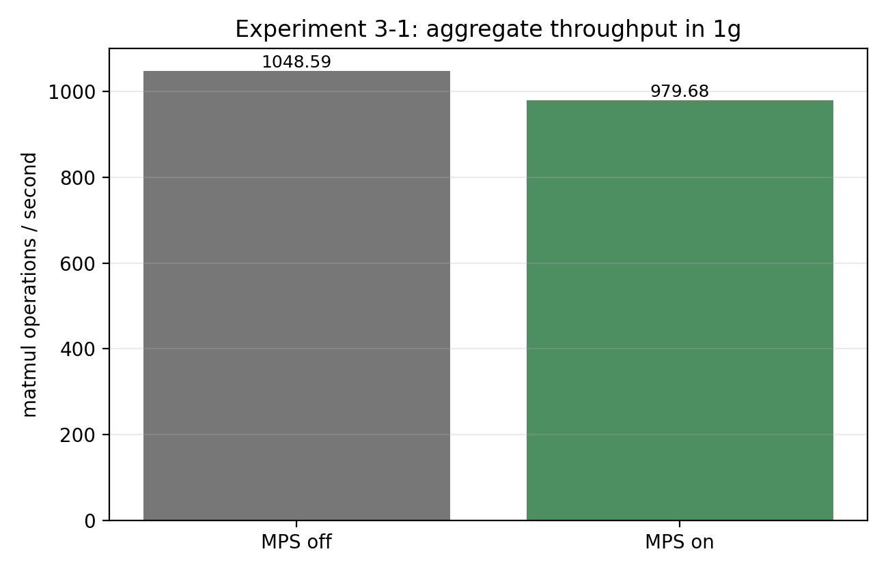

# 실험 3-1 — 같은 1g MIG slice에서 MPS on/off

## 목적

한 1g MIG 인스턴스 안에서 CUDA 프로세스 두 개를 실행할 때, MPS(Multi-Process Service)가 처리량·latency를 개선하는지 확인한다.

## 배경지식

MPS는 여러 CUDA client process를 MPS server를 통해 GPU에 연결해, 작은 커널이나 남는 GPU 자원을 가진 작업에서 더 자연스러운 동시 실행을 노리는 기술이다. MPS가 켜져 있다고 해서 모든 workload가 빨라지는 것은 아니다. 각 작업이 이미 GPU를 포화시키면 두 작업은 동일한 1g 자원을 경쟁하며, MPS server 관리 비용도 생긴다.

## 방법

1. 같은 1g MIG UUID를 보도록 한 Docker 컨테이너 안에서 worker A·B를 동시에 실행했다.
2. 각 worker는 2000×2000 FP32 matmul을 반복하고, 매 반복 CUDA-event latency를 CSV로 저장했다.
3. MPS off: MPS daemon 없이 두 worker를 시작했다.
4. MPS on: `nvidia-cuda-mps-control -d`로 daemon을 시작한 후 같은 두 worker를 시작했다.
5. aggregate throughput은 두 worker의 측정 throughput 합으로 계산했다.

## 실제 결과

| 조건 | Aggregate throughput (ops/s) | 평균 CUDA latency (ms) | p95 CUDA latency (ms) |
|---|---:|---:|---:|
| MPS off | 1048.59 | 0.853 | 0.878 |
| MPS on | 979.68 | 1.940 | 2.003 |

MPS on은 이 실행에서 throughput이 **6.6% 낮고**, 평균 latency는 약 **2.27배** 높았다.

## 왜 성능이 낮아질 수 있는가: 가설

1. **포화 workload 가설**: 2000×2000 matmul은 1g의 SM/메모리 자원을 이미 많이 사용한다. 겹쳐 실행할 남는 자원이 없으면 MPS는 병렬성을 만들지 못하고 경쟁만 증가시킨다.
2. **MPS 관리 비용 가설**: MPS server를 거치는 client 연결·스케줄링 비용이 큰 matmul 두 개의 이득보다 클 수 있다.
3. **실험 순서/열 상태 가설**: MPS off를 먼저, on을 나중에 실행했고 기존 스크립트는 Bash 특수 변수 `SECONDS`를 기간 변수로 사용했다. 실제 on 실행은 약 63초로 늘어났다. throughput은 관측 시간으로 정규화했지만, 후속 실행의 온도·클럭·백그라운드 상태가 섞였을 수 있다.
4. **MPS 동작 검증 부족 가설**: daemon 시작 명령은 실행했지만, 현재 데이터에는 kernel overlap을 직접 보여주는 Nsight Systems 타임라인이 없다.

## 필요한 추가 실험

1. 수정된 `RUN_SECONDS` 스크립트로 MPS off/on을 각각 최소 3회 실행한다.
2. 실행 순서를 `off→on`, `on→off`로 번갈아 배치하고, 각 run 사이 idle/cool-down 시간을 둔다.
3. 현재 large matmul 외에 256×256 또는 512×512의 작은 matmul도 시험한다. MPS는 작은 커널·저활용 조건에서 이득이 나타날 가능성이 더 크다.
4. 각 run의 tegrastats 온도·클럭·전력 로그를 표에 함께 기록한다.
5. 각 worker에 NVTX range를 넣고 Nsight Systems에서 두 process kernel timeline이 실제 겹치는지 확인한다. overlap이 없으면 MPS 성능 결론 이전에 MPS 동작 설정을 점검해야 한다.

## 결론

현재 결과는 MPS가 항상 성능을 올린다는 가설과 맞지 않는다. 그러나 기간 변수 버그와 순차 실행 조건 때문에 MPS 자체의 일반적 성능 결론으로 확정할 수 없다. 포화 workload와 실행 순서·열 상태를 통제한 반복 실험, 그리고 kernel overlap 타임라인 검증이 다음 단계다.
