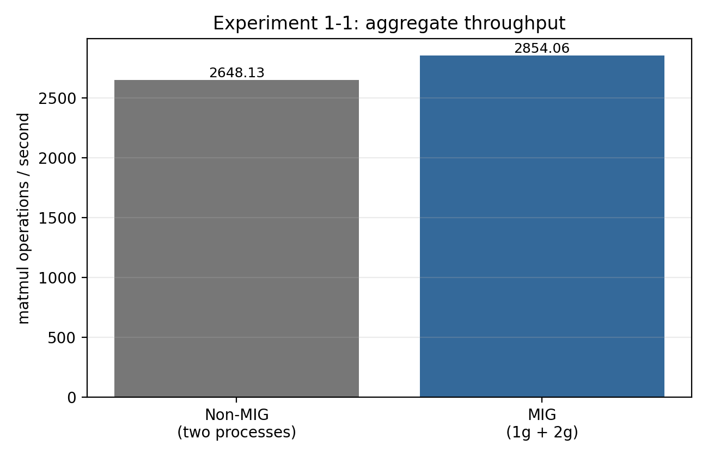
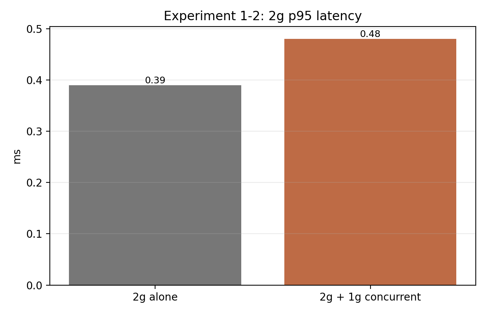
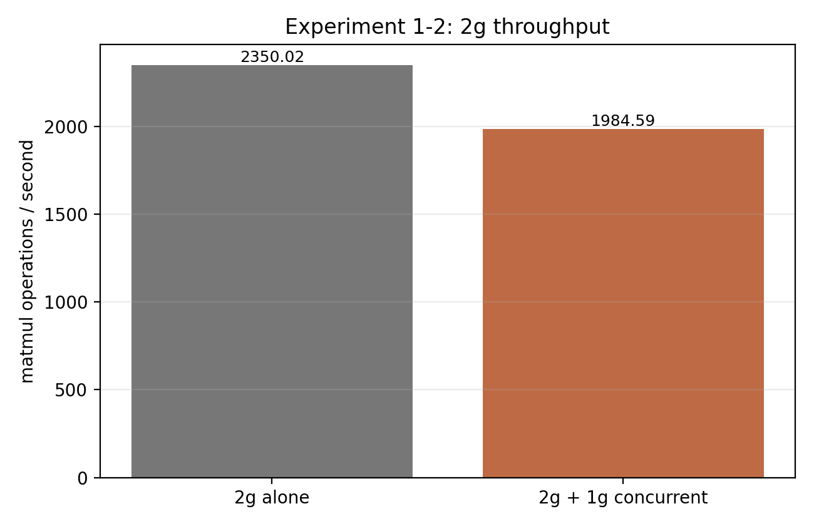
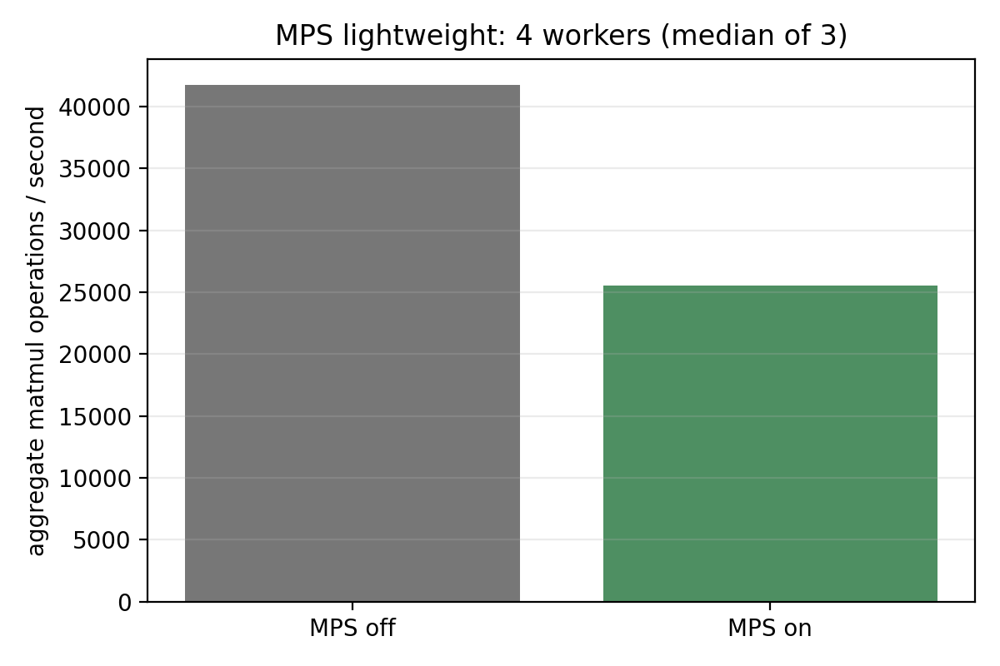
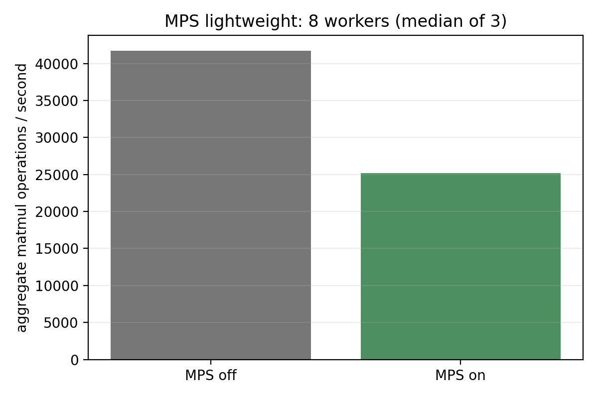
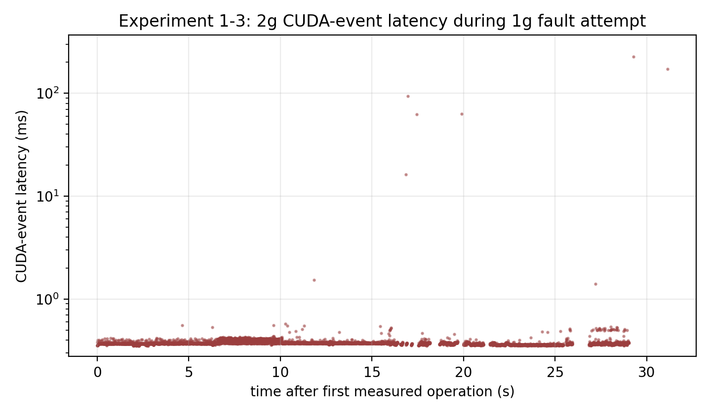

# Jetson AGX Thor MIG/MPS 실험 보고서 — 실제 CSV 기반

## 데이터 범위와 측정 방법

- 장비: NVIDIA Thor, Driver 595.78, CUDA 13.2 (실행 당시 `nvidia-smi` 기록).
- 워크로드: 각 프로세스가 2000×2000 FP32 `torch.matmul`을 반복했다.
- latency는 각 matmul 앞뒤의 CUDA event로 측정했고 매 반복마다 `torch.cuda.synchronize()` 했다. 따라서 Nsight CUDA API 호출 시간이 아니라 GPU event elapsed time이다.
- throughput은 각 CSV의 반복 수 / 관측 구간으로 계산했다. 두 워커 조건의 aggregate throughput은 각 워커 throughput의 합이다.
- 조건마다 1회 실행만 존재한다. 평균·p95는 **그 실행 안의 반복 분포**이지 반복 실험의 신뢰구간이 아니다.

## 실험 1-1 — MIG vs Non-MIG 동시 실행

| 조건 | Aggregate throughput (ops/s) | 반복 수 |
|---|---:|---:|
| Non-MIG, 2 processes | 2648.13 | 121814 |
| MIG, 1g + 2g | 2854.06 | 89656 |

MIG 조건의 aggregate throughput은 Non-MIG 대비 +7.8%이다. 1g·2g·전체 GPU의 latency 분포를 섞은 aggregate p95는 직접 비교 가능한 지표가 아니므로 보고하지 않는다. 이 결과는 시스템 수준 처리량 비교다.

## 실험 1-2 — 공유 메모리 경합 가설

2g 단독과 1g+2g 동시 실행에서 2g만 비교했다.

| 2g 조건 | Throughput (ops/s) | 평균 CUDA latency (ms) | p95 CUDA latency (ms) |
|---|---:|---:|---:|
| 단독 | 2350.02 | 0.370 | 0.390 |
| 1g 동시 부하 | 1984.59 | 0.438 | 0.481 |

동시 부하에서 2g throughput은 -15.6%, p95 latency는 +23.3% 변했다. 이는 동시 실행이 2g 작업에 영향을 줄 수 있다는 **관측 결과**다. `tegrastats.log`는 각 run directory에 원시 로그로 보존했다. 이 한 번의 matmul 실험만으로 DRAM/메모리 컨트롤러 병목을 증명할 수는 없고, 원인 후보를 뒷받침하는 수준으로 해석해야 한다.

## 실험 3-1 — 경량 다중 worker MPS 추가 실험

기존 heavy MPS 비교는 off 30초/on 63초의 기간 변수 오류와 단일 순차 실행 때문에 pilot으로만 남긴다. 아래 반복 결과를 사용한다.

| Worker 수 | MPS off 중앙값 (ops/s) | MPS on 중앙값 (ops/s) | 변화 |
|---:|---:|---:|---:|
| 4 | 41,762.93 | 25,508.32 | -38.9% |
| 8 | 41,743.27 | 25,152.84 | -39.7% |

4·8 worker 각각 MPS on/off를 3회 반복하고 실행 순서를 교차했다. 따라서 이 workload·batch·1g 조건에서 MPS on의 throughput 이득이 관찰되지 않았다는 결론은 가능하다. 다만 Nsight Systems overlap trace가 없으므로 원인을 일반적인 MPS 특성으로 단정하지 않는다. 상세 수치와 한계는 [추가 실험 보고서](exp_3_1_lightweight_report.md)와 [객관성 감사](objective_data_audit.md)를 참조한다.

## 실험 1-3 — Fault isolation: 확인된 사실과 결론

보존된 fault run(`20260830_181838_fault`)에서 2g 대상 작업은 56966회를 완료했다. 평균 CUDA latency는 0.450 ms, p95는 0.409 ms, p99는 0.484 ms, 최대값은 308.332 ms이다. 즉 2g CSV가 생성되고 정상 종료된 사실은 확인된다. 평균과 p95가 작더라도, 타임라인의 희소한 큰 이상치는 별도로 확인해야 한다.

그러나 1g 컨테이너에는 기대한 `expected_cuda_oom` JSON이 생성되지 않았다. 호스트 journal에는 같은 fault 실행 뒤 사용자 서비스가 OOM killer에 의해 종료된 기록이 있다. 따라서 이 실험은 “1g의 CUDA OOM이 2g에 격리됐다”를 입증하지 못한다. 더 정확한 결론은 **현재의 무한 CUDA 할당 방식이 Jetson UMA 시스템 메모리 부족을 유발했고, fault-isolation 실험으로는 안전하지 않았다**이다. 이 결과는 Jetson에서의 실험 설계 제약을 보여 준다.

